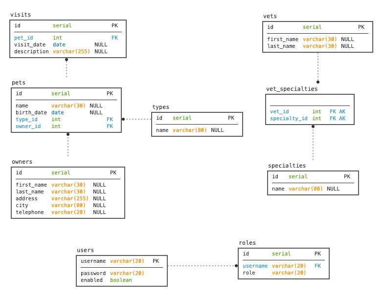

# PetClinic AI Platform — REST API

A personal portfolio project by Vince Smith. This repository currently contains the **backend REST API**: a Spring Boot service for managing a veterinary clinic's owners, pets, veterinarians, visits, and specialties, contract-first against an OpenAPI spec.

It began as a fork of [Spring's official `spring-petclinic-rest` reference sample](https://github.com/spring-petclinic/spring-petclinic-rest) and has since been refactored toward a leaner, more opinionated architecture (single Spring Data JPA persistence implementation instead of three parallel jdbc/jpa/spring-data-jpa variants, a collapsed service layer, etc.) as a base to build on.

## Roadmap

This is the first of three planned pieces of a larger platform:

- [x] **Backend REST API** (this repository) — Spring Boot, Spring Data JPA, contract-first OpenAPI
- [ ] **Front-end** — a client application consuming this API
- [ ] **AI service** — an AI-powered service integrated alongside the core clinic API

## Tech Stack

- Java 25, Spring Boot 4, Spring MVC, Spring Data JPA, Spring Security
- H2 / HSQLDB / MySQL / PostgreSQL (swappable via Spring profile)
- MapStruct (entity ⇄ DTO mapping), OpenAPI Generator (contract-first DTOs/API interfaces)
- springdoc-openapi (Swagger UI), JaCoCo (coverage gate), Jib (container image build)

### Petclinic ER Model



## Running Petclinic locally

### With Maven command line
```sh
git clone https://github.com/vinceo8691-prog/petclinic-ai-platform.git
cd petclinic-ai-platform
./mvnw spring-boot:run
```

### With Docker
Build and run a local image (no image is currently published to a registry for this fork):
```sh
./mvnw compile jib:dockerBuild
docker run -p 9966:9966 vinceo8691/spring-petclinic-rest
```

You can then access petclinic here: [http://localhost:9966/petclinic/](http://localhost:9966/petclinic/)

There is an actuator health check route as well:
* [http://localhost:9966/petclinic/actuator/health](http://localhost:9966/petclinic/actuator/health)

## 📖 OpenAPI REST API Documentation
This project provides a RESTful API for managing a veterinary clinic's **owners, pets, veterinarians, visits, and specialties**.

### **Access Swagger UI**
Swagger UI is available at: [http://localhost:9966/petclinic/swagger-ui.html](http://localhost:9966/petclinic/swagger-ui.html).

API documentation (OAS 3.1) is accessible at: [http://localhost:9966/petclinic/v3/api-docs](http://localhost:9966/petclinic/v3/api-docs).


## 📌 API Endpoints Overview

| **Method** | **Endpoint** | **Description** |
|-----------|------------|----------------|
| **Owners** |  |  |
| **GET** | `/api/owners` | Retrieve all pet owners |
| **GET** | `/api/owners/{ownerId}` | Get a pet owner by ID |
| **POST** | `/api/owners` | Add a new pet owner |
| **PUT** | `/api/owners/{ownerId}` | Update an owner’s details |
| **DELETE** | `/api/owners/{ownerId}` | Delete an owner |
| **GET** | `/api/owners/{ownerId}/pets/{petId}` | Get a pet by ID (owner’s pet) |
| **PUT** | `/api/owners/{ownerId}/pets/{petId}` | Update pet details (owner’s pet) |
| **POST** | `/api/owners/{ownerId}/pets` | Add a new pet to an owner |
| **POST** | `/api/owners/{ownerId}/pets/{petId}/visits` | Add a vet visit for a pet |
| **Pets** |  |  |
| **GET** | `/api/pets` | Retrieve all pets |
| **GET** | `/api/pets/{petId}` | Get a pet by ID |
| **PUT** | `/api/pets/{petId}` | Update pet details |
| **DELETE** | `/api/pets/{petId}` | Delete a pet |
| **Vets** |  |  |
| **GET** | `/api/vets` | Retrieve all veterinarians |
| **GET** | `/api/vets/{vetId}` | Get a vet by ID |
| **POST** | `/api/vets` | Add a new vet |
| **PUT** | `/api/vets/{vetId}` | Update vet details |
| **DELETE** | `/api/vets/{vetId}` | Delete a vet |
| **Pet Types** |  |  |
| **GET** | `/api/pettypes` | Retrieve all pet types |
| **GET** | `/api/pettypes/{petTypeId}` | Get a pet type by ID |
| **POST** | `/api/pettypes` | Add a new pet type |
| **PUT** | `/api/pettypes/{petTypeId}` | Update pet type details |
| **DELETE** | `/api/pettypes/{petTypeId}` | Delete a pet type |
| **Specialties** |  |  |
| **GET** | `/api/specialties` | Retrieve all vet specialties |
| **GET** | `/api/specialties/{specialtyId}` | Get a specialty by ID |
| **POST** | `/api/specialties` | Add a new specialty |
| **PUT** | `/api/specialties/{specialtyId}` | Update a specialty |
| **DELETE** | `/api/specialties/{specialtyId}` | Delete a specialty |
| **Visits** |  |  |
| **GET** | `/api/visits` | Retrieve all vet visits |
| **GET** | `/api/visits/{visitId}` | Get a visit by ID |
| **POST** | `/api/visits` | Add a new visit |
| **PUT** | `/api/visits/{visitId}` | Update a visit |
| **DELETE** | `/api/visits/{visitId}` | Delete a visit |
| **Users** |  |  |
| **POST** | `/api/users` | Create a new user |

## Database configuration

By default, Petclinic uses an **in-memory H2 database**, which is automatically populated with sample data at startup.

### **Supported Databases**

Petclinic supports the following databases:

- **H2 (Default, In-Memory)**
- **HSQLDB (Alternative In-Memory Option)**
- **MySQL (Persistent)**
- **PostgreSQL (Persistent)**

### **Switching Databases**

You can change the database by updating the `spring.profiles.active` property in `application.properties`:

| Database  | Profile Configuration |
|-----------|----------------------|
| **H2** (Default)  | `spring.profiles.active=h2` |
| **HSQLDB** (Alternative In-Memory) | `spring.profiles.active=hsqldb` |
| **MySQL** (Persistent) | `spring.profiles.active=mysql` |
| **PostgreSQL** (Persistent) | `spring.profiles.active=postgres` |

For more details, see the [Spring Boot documentation](https://docs.spring.io/spring-boot/how-to/properties-and-configuration.html#howto.properties-and-configuration.set-active-spring-profiles).

The repository layer itself is always Spring Data JPA — only the target database changes between profiles.

### **Using H2 (Default)**
- No additional setup is required.
- The database schema and sample data are loaded automatically from `src/main/resources/db/h2/`.
- You can access the **H2 Console** to inspect the database.

### **Accessing the H2 Console**
1. **Run the application:**
   ```sh
   mvn spring-boot:run
   ```
2. **Open H2 Console in your browser:**
   - **URL**: http://localhost:9966/petclinic/h2-console
   - **JDBC URL**: `jdbc:h2:mem:petclinic`
   - **Username**: `sa`
   - **Password**: _(leave blank)_

### **Using HSQLDB**
- HSQLDB works similarly to H2 as an **in-memory database**.
- No additional setup is required—schema and sample data are loaded automatically from `src/main/resources/db/hsqldb/`.
- Swtich to **HSQLDB** by modifying `application.properties`:

    ```properties
    spring.profiles.active=hsqldb
    ```

### **Using MySQL**
Modify `application.properties`:

```properties
spring.profiles.active=mysql
```
Start a MySQL database using Docker:
```bash
docker run -e MYSQL_USER=petclinic -e MYSQL_PASSWORD=petclinic -e MYSQL_ROOT_PASSWORD=root -e MYSQL_DATABASE=petclinic -p 3306:3306 mysql:8.4
```

### **Using PostgreSQL**
Modify application.properties:

```properties
spring.profiles.active=postgres
```
Start a PostgreSQL database using Docker:
```bash
docker run -e POSTGRES_USER=petclinic -e POSTGRES_PASSWORD=petclinic -e POSTGRES_DB=petclinic -p 5432:5432 postgres:16.3
```

Instead of manually running containers, you can also use `docker-compose.yml`:

```sh
docker-compose --profile mysql up
docker-compose --profile postgres up
```

### **Further Documentation**
- [HSQLDB](http://hsqldb.org/doc/2.0/guide/index.html)
- [MySQL](https://github.com/spring-projects/spring-petclinic/blob/main/src/main/resources/db/mysql/petclinic_db_setup_mysql.txt)
- [PostgreSQL](https://github.com/spring-projects/spring-petclinic/blob/main/src/main/resources/db/postgres/petclinic_db_setup_postgres.txt)

## API First Approach

This API is built following some [API First approach principles](https://swagger.io/resources/articles/adopting-an-api-first-approach/).

It is specified through the [OpenAPI](https://oai.github.io/Documentation/).
It is specified in this [file](./src/main/resources/openapi.yml).

Some of the required classes are generated during the build time. 
Here are the generated file types:
* DTOs
* API template interfaces specifying methods to override in the controllers

To see how to get them generated you can read the next chapter. 

## Generated code

Some of the required classes are generated during the build time using maven or any IDE (e.g., IntelliJ Idea or Eclipse).

All of these classes are generated into the ``target/generated-sources`` folder.

Here is a list of the generated packages and the corresponding tooling:

| Package name                                   | Tool             |
|------------------------------------------------|------------------|
| org.springframework.samples.petclinic.mapper   | [MapStruct](https://mapstruct.org/)        |
| org.springframework.samples.petclinic.rest.dto | [OpenAPI Generator maven plugin](https://github.com/OpenAPITools/openapi-generator/) |


To get both, you have to run the following command:

```jshelllanguage
mvn clean install
```

## Security configuration
In its default configuration, Petclinic doesn't have authentication and authorization enabled.

### Basic Authentication
In order to use the basic authentication functionality, turn in on from the `application.properties` file
```properties
petclinic.security.enable=true
```
This will secure all APIs and in order to access them, basic authentication is required.
Apart from authentication, APIs also require authorization. This is done via roles that a user can have.
The existing roles are listed below with the corresponding permissions 

* `OWNER_ADMIN` -> `OwnerController`, `PetController`, `PetTypeController` (`getAllPetTypes` and `getPetType`), `VisitController`
* `VET_ADMIN`   -> `PetTypeController`, `SpecialityController`, `VetController`
* `ADMIN`       -> `UserController`

There is an existing user with the username `admin` and password `admin` that has access to all APIs.
 In order to add a new user, please make `POST /api/users` request with the following payload:

```json
{
    "username": "secondAdmin",
    "password": "password",
    "enabled": true,
    "roles": [
    	{ "name" : "OWNER_ADMIN" }
    ]
}
```

## Working with Petclinic in Eclipse/STS

### prerequisites
The following items should be installed in your system:
* Maven 3 (https://maven.apache.org/install.html)
* git command line tool (https://help.github.com/articles/set-up-git)
* Eclipse with the m2e plugin (m2e is installed by default when using the STS (http://www.springsource.org/sts) distribution of Eclipse)

Note: when m2e is available, there is an m2 icon in Help -> About dialog.
If m2e is not there, just follow the install process here: http://eclipse.org/m2e/download/
* Eclipse with the [mapstruct plugin](https://mapstruct.org/documentation/ide-support/) installed.

### Steps:

1) In the command line
```sh
git clone https://github.com/vinceo8691-prog/petclinic-ai-platform.git
```
2) Inside Eclipse
```
File -> Import -> Maven -> Existing Maven project
```

## Looking for something in particular?

| Layer | Source |
|--|--|
| REST API controllers | [REST folder](src/main/java/org/springframework/samples/petclinic/rest) |
| Service | [ClinicService.java](src/main/java/org/springframework/samples/petclinic/service/ClinicService.java) |
| Repository (Spring Data JPA) | [springdatajpa folder](src/main/java/org/springframework/samples/petclinic/repository/springdatajpa) |
| Tests | [AbstractClinicServiceTests.java](src/test/java/org/springframework/samples/petclinic/service/clinicService/AbstractClinicServiceTests.java) |

## Publishing a Docker image

This application uses [Google Jib](https://github.com/GoogleContainerTools/jib) to build an optimized Docker image without needing a local Docker daemon for the build itself.

The image name/registry target is controlled by the `docker.image.prefix` property in [pom.xml](pom.xml) (currently still set to the placeholder `springcommunity`, inherited from the upstream project this repo was forked from) — update it to your own Docker Hub namespace before publishing.

Command line to run:
```sh
mvn compile jib:build -X -DjibSerialize=true -Djib.to.auth.username=xxx -Djib.to.auth.password=xxxxx
```

## Performance Testing

To benchmark the scalability of the PetClinic REST API, a JMeter test plan is available.

- See the [JMeter Performance Test](src/test/jmeter/README.md) for details.
- Run the test using:
  ```sh
  jmeter -n -t src/test/jmeter/petclinic-jmeter-crud-benchmark.jmx \
  -Jthreads=100 -Jduration=600 -Jops=2000 -Jramp_time=120 \
  -l results/petclinic-test-results.jtl

## API Testing with Postman + Newman

This project contains **non-regression tests** for the Petclinic API, built with **Postman** and executed via **Newman**, with automated **HTML reports** for easy analysis.

- See the [Postman + Newman Test](src/test/postman/README.md) for details.
- You can run the tests with 2 ways:
  I. Giving Execution Permission to the script file:
    ```sh
    chmod +x postman-tests.sh
    ./postman-tests.sh
    ```
  II. Without Permission to the script file:
    ```sh
    zsh postman-tests.sh
    ```
> Note: You can use your currently bash installed. Like: "bash postman-tests.sh"

There is also a separate `src/test/postman/petclinic-exploration.postman_collection.json` collection, meant for manual/interactive exploration of every endpoint rather than automated regression assertions.

## Acknowledgments

This project is built on top of [Spring's official `spring-petclinic-rest`](https://github.com/spring-petclinic/spring-petclinic-rest), part of the wider [Spring Petclinic](https://github.com/spring-petclinic) community, licensed under the Apache License 2.0 (see [LICENSE.txt](LICENSE.txt)). Credit to the original authors and contributors for the base application this project evolved from.
